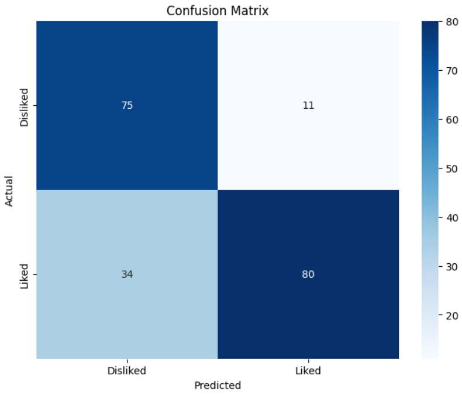
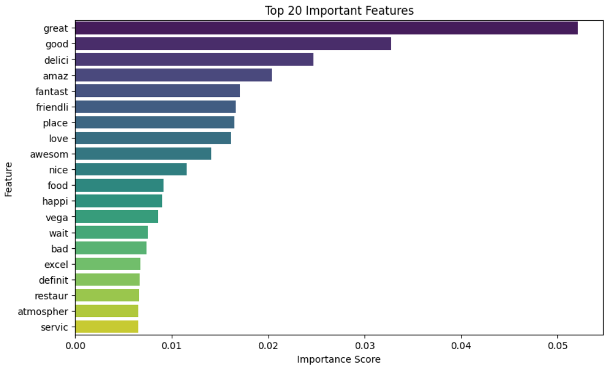
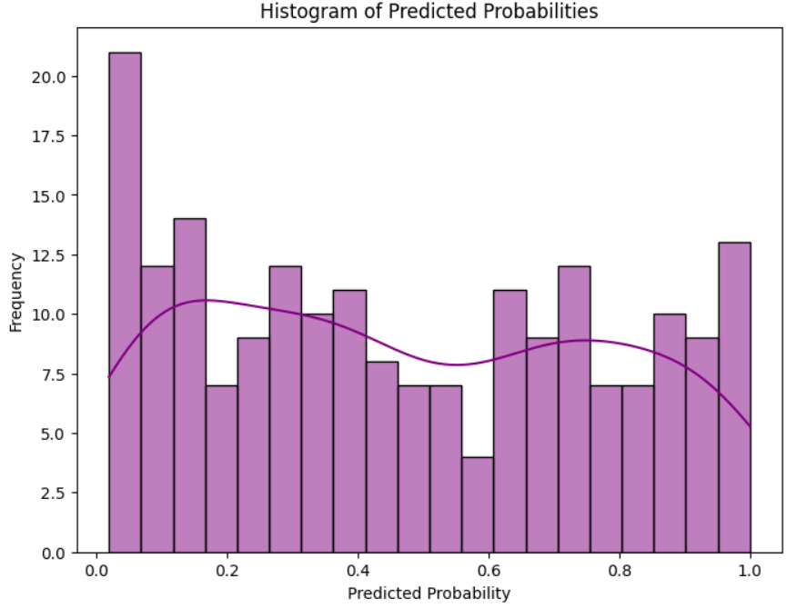

# Sentiment Analysis

This repository contains a comprehensive project on sentiment analysis, focusing on the classification of textual data into positive and negative sentiments using a Random Forest classifier. The primary objective of this project is to analyze customer reviews (e.g., restaurant reviews) and determine whether the sentiment expressed is favorable (Liked) or unfavorable (Disliked). By leveraging advanced machine learning techniques and text preprocessing, the model transforms raw textual data into meaningful insights. The process includes cleaning the data, extracting features using TF-IDF, and training a robust Random Forest model to ensure accurate sentiment classification. Additionally, the project features detailed visualizations to provide insights into model performance and feature importance, making it an invaluable tool for understanding customer feedback.

## Features
- Preprocessing of text data (tokenization, stemming, and stopword removal)
- TF-IDF vectorization for text feature extraction
- Sentiment classification using Random Forest
- Visualizations of the confusion matrix, feature importance, and predicted probabilities

## Dataset
The dataset used in this project contains restaurant reviews with binary labels:
- `Review`: Text of the review
- `Liked`: Sentiment label (1 for positive, 0 for negative)

Replace the file path in the code with the path to your dataset. The dataset file `Restaurant_Reviews.csv` is included in this repository.

## Project Structure
```plaintext
├── sentiment_analysis.ipynb   # Main script for sentiment analysis
├── Restaurant_Reviews.csv  # Dataset file
├── confusion_matrix.png    # Confusion Matrix Visualization
├── top_features.png        # Top 20 Important Features Visualization
├── probability_histogram.png # Histogram of Predicted Probabilities
└── README.md               # Project documentation
```

## Requirements
Install the required Python libraries:
```bash
pip install numpy pandas matplotlib seaborn scikit-learn nltk
```

## How to Run
1. Clone this repository:
   ```bash
   git clone https://github.com/YourUsername/Sentiment-Analysis-Restaurant-Reviews
   cd Sentiment-Analysis-Restaurant-Reviews
   ```
2. Place the dataset (`Restaurant_Reviews.csv`) in the project folder.
3. Run the script:
   ```bash
   python sentiment_analysis.py
   ```

## Methodology
1. **Data Preprocessing**
   - Remove non-alphabetic characters.
   - Convert text to lowercase.
   - Tokenize text.
   - Remove stopwords using NLTK.
   - Apply stemming using Porter Stemmer.

2. **Feature Extraction**
   - Convert text data into numerical features using TF-IDF vectorization.

3. **Model Training**
   - Train a Random Forest classifier on the preprocessed data.

4. **Evaluation and Visualization**
   - Calculate accuracy and generate a classification report.
   - Visualize the confusion matrix, feature importance, and predicted probabilities.


## Results
- **Accuracy**: 85.50%

- **Classification Report**:
  ```
              precision    recall  f1-score   support

           0       0.69      0.87      0.77        86
           1       0.88      0.70      0.78       114

    accuracy                           0.78       200
   macro avg       0.78      0.79      0.77       200
  weighted avg     0.80      0.78      0.78       200
  ```

## Example Output
### Confusion Matrix


### Top 20 Features


### Probability Histogram


## References
- [Scikit-learn Documentation](https://scikit-learn.org/)
- [NLTK Documentation](https://www.nltk.org/)

## Author
Shreyak Mukherjee

Feel free to contribute to the project or report any issues!
